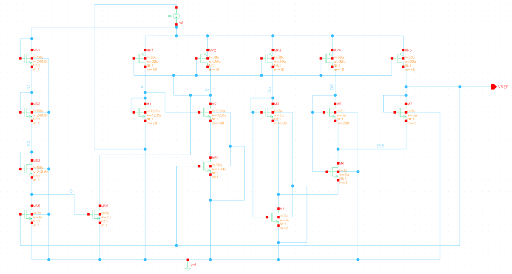
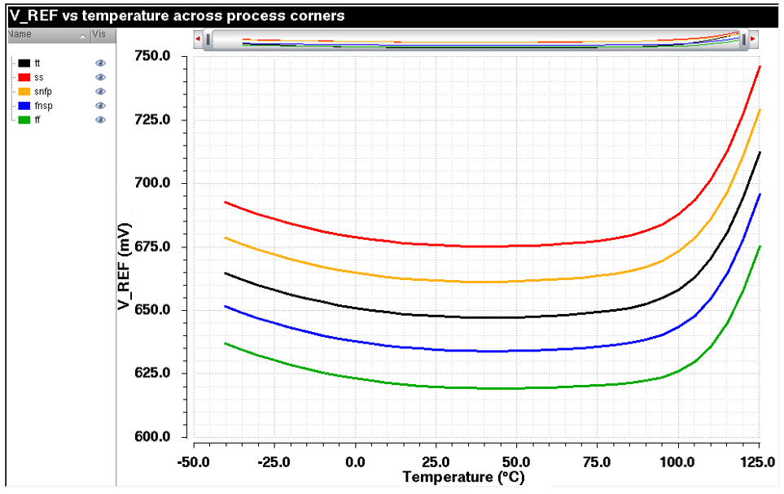
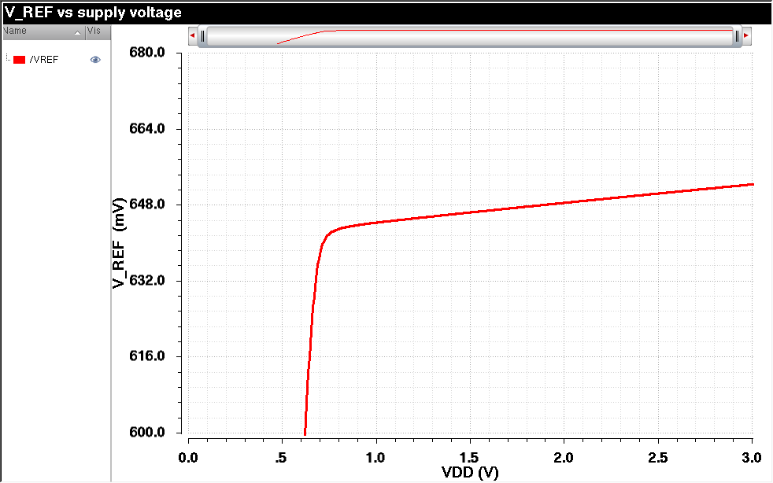
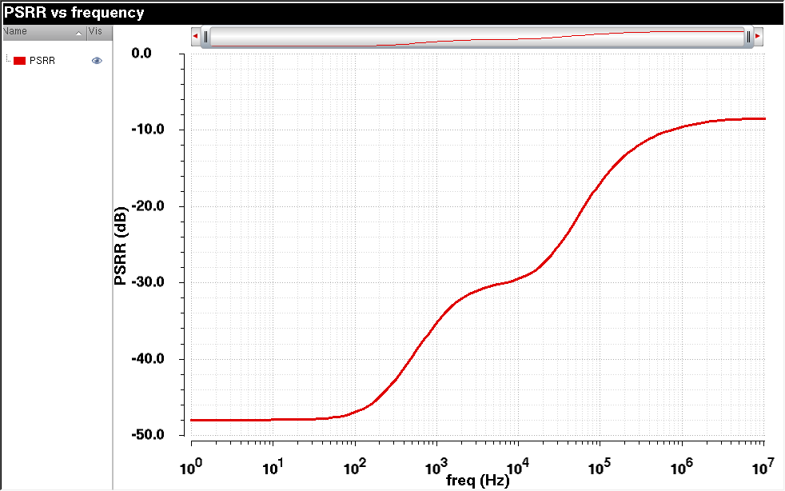
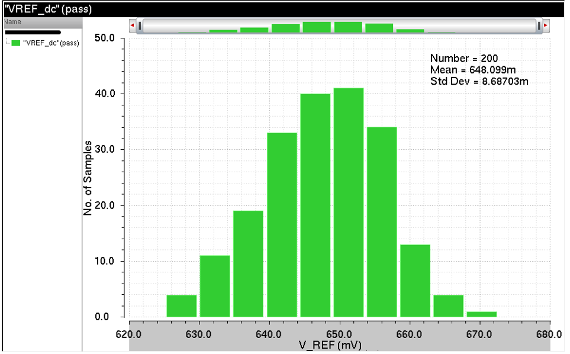
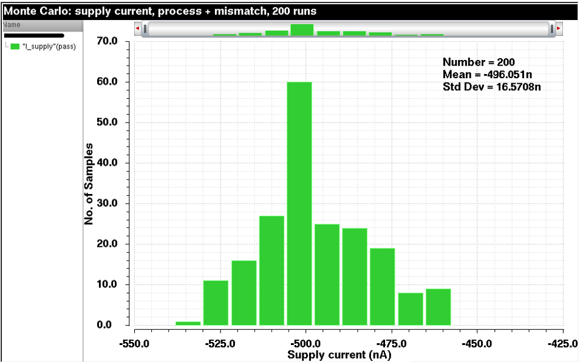
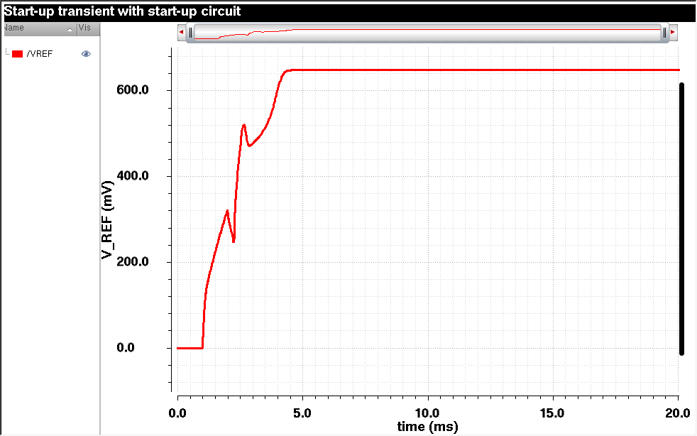
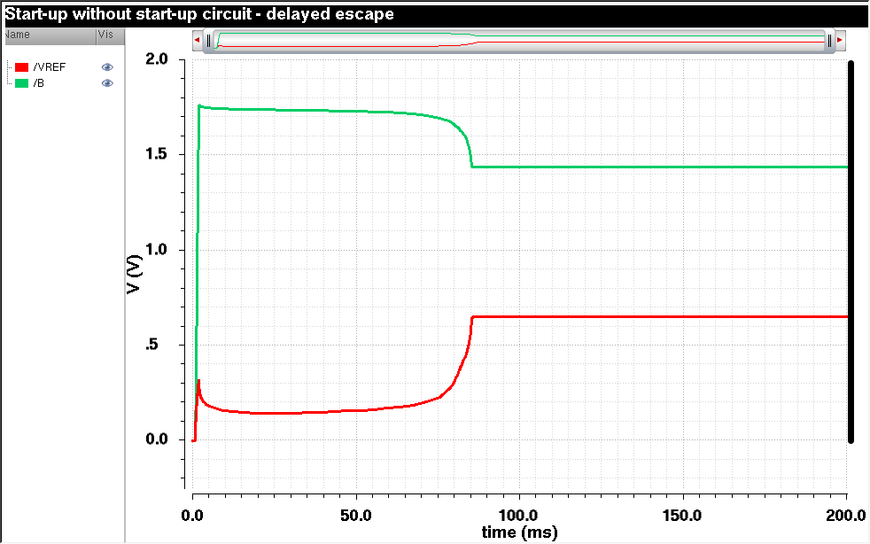
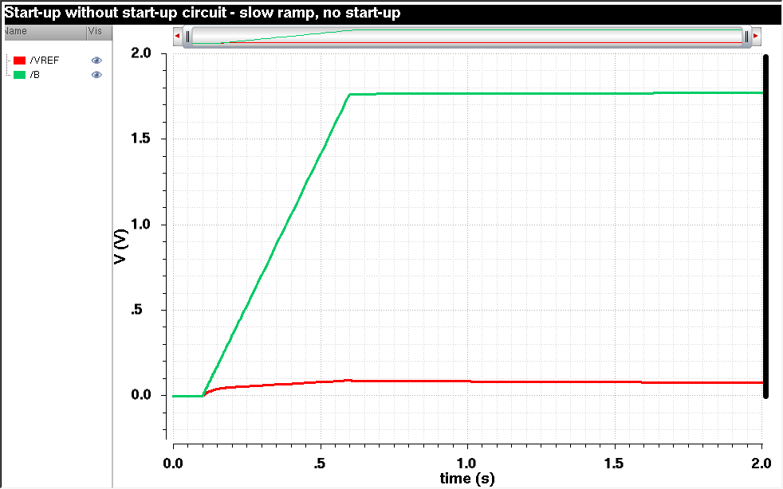

# All-MOSFET Subthreshold Voltage Reference in 180 nm CMOS

A complete design and characterisation of a resistor-free CMOS voltage reference built entirely
from MOSFETs biased in weak inversion. The circuit produces 647.6 mV at 27 °C from a 911 nW
supply budget, holds 198 ppm/°C over −40 to 95 °C, and operates from supplies down to 0.75 V.
Verification covers five process corners, 200-run Monte Carlo with a validated variance
decomposition, AC supply rejection, and a ten-year NBTI/HCI aging simulation. The start-up
behaviour is characterised in detail: the circuit is bistable, and the dead state is stable
under a slow supply ramp — a failure a conventional fast-ramp testbench does not reveal.

**Author:** A. S. S. V. Sathvik (23ECB1A15), B.Tech ECE (VLSI Design and Technology),
NIT Warangal.

**Process:** UMC 180 nm 1P6M mixed-mode CMOS. No PDK content is included in this repository —
see [Disclosure](#disclosure).

---

## Conventions

Figures of merit can differ by several percent depending on how they are defined, so the
definitions used throughout are fixed here.

**Temperature coefficient** — box method over a stated window:
TC = (V_max − V_min) / (V̄ · ΔT), where V̄ is the mean of V_REF over that window. Quoted with its
range in every instance; the number is meaningless without it.

**Line sensitivity** — endpoint slope normalised to the nominal output:
LS = (ΔV_REF / ΔV_DD) / V_REF(1.8 V), with V_REF(1.8 V) = 647.64 mV. Quoted with its supply range.
The response is not linear, so the range matters — see [Supply](#supply).

**Variance shares** — quoted against the reconstructed sum σ_process² + σ_mismatch², not against
the measured combined variance. The two denominators differ because the quadrature reconstruction
overshoots the measurement by 1.7 %; both figures are given where it matters.

All measurements at V_DD = 1.8 V, typical corner, 27 °C unless stated otherwise. Temperature
sweeps use 5 °C steps, so the nearest sampled point to 27 °C is 25 °C; both appear below and the
difference is under 0.2 mV.

---

## Repository layout

```
.
├── circuit/
│   └── vref_subthreshold.scs     Device-agnostic netlist: topology, sizing and the
│                                 DC/temperature/supply/AC/transient analysis statements.
│                                 Generic nch/pch models, no foundry data.
├── data/
│   ├── vref_vs_temp_tt.csv       V_REF vs temperature, typical corner
│   ├── vref_vs_temp_ss.csv       slow-N slow-P
│   ├── vref_vs_temp_ff.csv       fast-N fast-P
│   ├── vref_vs_temp_snfp.csv     slow-N fast-P
│   ├── vref_vs_temp_fnsp.csv     fast-N slow-P
│   ├── vref_vs_vdd.csv           V_REF vs supply, 0.4–3.0 V, 5 mV steps, 521 points
│   ├── mc_all.csv                200 Monte Carlo samples, process + mismatch
│   ├── mc_process.csv            200 samples, process only
│   └── mc_mismatch.csv           200 samples, mismatch only
├── figures/
│   ├── schematic.png
│   ├── vref_vs_temperature_corners.png
│   ├── vref_vs_vdd.png
│   ├── psrr_vs_frequency.png
│   ├── startup_with_kick.png
│   ├── startup_nokick_nodeb.png
│   ├── startup_nokick_slowramp.png
│   ├── mc_vref.png
│   └── mc_isupply.png
├── results/
│   ├── summary.txt               All measured figures of merit
│   ├── corners.txt               Five-corner table
│   ├── monte_carlo.txt           Decomposition and quadrature check
│   └── aging.txt                 Ten-year degradation results
├── .gitignore
├── LICENSE
└── README.md
```

---

## Circuit topology



The design follows the all-MOSFET subthreshold reference of Ueno et al. [1]. Three functional
blocks share one PMOS mirror rail:

**Current source (M1, M2, MR1).** A self-biased loop where M1 and M2 have the same W/L but
different multiplicities, so the loop settles at a current set by their ratio and the thermal
voltage. MR1 operates as a MOS resistor with its gate tied to V_REF, closing the loop.

**Bias voltage generator (M3–M7).** A stacked ladder that sums currents in a 1× / 3× / 2×
arrangement. M3 and M5 are wide (m = 280) and operate deep in weak inversion; M4, M6 and M7 are
narrow devices at m = 2. The output V_REF is the gate–source voltage of M7 plus the ladder drops,
which combines a term proportional to absolute temperature with the negative temperature
coefficient of the threshold voltage.

**Start-up circuit (MS1–MS3, MS5, MS6).** A three-deep long-channel diode stack senses the
supply, MS5 senses V_REF, and MS6 injects current into the mirror rail (node B) when V_REF is
low. In steady state MS6 carries 8.69 pA, so the start-up circuit contributes nothing measurable
to the 911 nW total.

The numbering skips MS4: that device was the fourth diode of the original stack, removed during
sizing for the reason given under [How the sizing was derived](#how-the-sizing-was-derived). The
remaining devices kept their original labels so that this repository matches the simulation
netlists exactly.

There are no resistors, no bipolar devices, and no amplifiers.

### Sizing

| Device | W / L | m | Function |
|---|---|---|---|
| MP1–MP5 | 30 µm / 30 µm | 10 | PMOS current mirrors |
| M1 | 12 µm / 12 µm | 20 | Current source, diode-connected |
| M2 | 12 µm / 12 µm | 100 | Current source |
| MR1 | 1.34 µm / 50 µm | 1 | MOS resistor, gate on V_REF |
| M3, M5 | 3 µm / 3 µm | 280 | Bias ladder, wide devices |
| M4, M6 | 3 µm / 3 µm | 2 | Bias ladder, narrow devices |
| M7 | 3 µm / 3 µm | 2 | Output device |
| MS1–MS3 | 0.24 µm / 50 µm | 1 | Start-up diode stack |
| MS5 | 1 µm / 3 µm | 1 | Start-up sense |
| MS6 | 3 µm / 3 µm | 1 | Start-up injection |

### How the sizing was derived

The reference paper targets a different process node, so its published device ratios were not
copied. Three device parameters were extracted from the target PDK by simulation before any
sizing was fixed: the subthreshold slope factor, the threshold-voltage temperature coefficient,
and the threshold voltage extrapolated to 0 K. The sizing follows from those, not from the paper.

Two adjustments came out of the process:

**M1 and M2 widths were increased to 12 µm.** Line sensitivity was initially poor. A controlled
experiment — sweeping supply while monitoring each branch separately — localised the cause to
drain-induced barrier lowering in the current-source pair rather than channel-length modulation
in the ladder. Widening M1 and M2 roughly halved the line sensitivity.

**One diode was removed from the start-up stack (MS4).** The original four-deep stack held node B
too low at high supply, wasting current. Three diodes give the same start-up reliability with
less static draw.

---

## Results

| Parameter | Value | Condition |
|---|---|---|
| V_REF | 647.6 mV | 27 °C, 1.8 V |
| Temperature coefficient | 198 ppm/°C | −40 to 95 °C, box method |
| Supply current | 506.4 nA | 27 °C |
| Power | 911 nW | 27 °C |
| Line sensitivity | 6 211 ppm/V | 1.0 to 3.0 V |
| Minimum supply | 0.75 V | V_REF within 1 % of nominal |
| PSRR | −48 dB | DC to 40 Hz |
| PSRR | −47 dB | 100 Hz |
| PSRR | −8.5 dB | above 3 MHz |
| Monte Carlo σ/µ | 1.40 % | 200 runs, process + mismatch |
| Monte Carlo yield | 100 % | 200 / 200 |
| Start-up time | 4.3 ms | 1 ms supply ramp |
| Ten-year drift | −9.90 mV (−1.53 %) | 27 °C |

### Temperature



The curve is a shallow bowl with its minimum at 40 °C (647.26 mV), spanning only 17.40 mV from
−40 to 95 °C. Above 95 °C it turns up sharply. Increments below are per 5 °C step:

| Temperature | V_REF | Increment over previous 5 °C |
|---|---|---|
| 85 °C | 651.12 mV | — |
| 90 °C | 652.64 mV | +1.51 mV |
| 95 °C | 654.86 mV | +2.23 mV |
| 100 °C | 658.19 mV | +3.33 mV |
| 105 °C | 663.17 mV | +4.97 mV |
| 110 °C | 670.43 mV | +7.26 mV |
| 115 °C | 680.64 mV | +10.22 mV |
| 120 °C | 694.41 mV | +13.76 mV |
| 125 °C | 712.16 mV | +17.75 mV |

Each 5 °C step multiplies the increment by 1.3 to 1.5, so the increment roughly doubles every
10 °C. That is exponential growth, not polynomial curvature. The cause is the core devices
leaving weak inversion: subthreshold current rises with temperature until the M3/M5 stack no
longer satisfies the regime the topology assumes.

**The upper operating limit is therefore approximately 95 °C.** Over the full −40 to 125 °C span
the box-method TC is 599 ppm/°C, but that number averages a working region with a broken one and
is not a meaningful specification. Reported for completeness only.

### Process corners

| Corner | V_REF at 25 °C | TC, −40 to 95 °C |
|---|---|---|
| ss | 675.66 mV | 189 ppm/°C |
| snfp | 661.74 mV | 191 ppm/°C |
| tt | 647.76 mV | 198 ppm/°C |
| fnsp | 634.63 mV | 205 ppm/°C |
| ff | 620.01 mV | 208 ppm/°C |

Absolute output spreads 55.65 mV, or ±4.30 % about the corner mean of 647.84 mV. Temperature
coefficient stays within 189–208 ppm/°C — a 10 % band against a 4.3 % shift in absolute level.

The asymmetry is structural. V_REF depends on absolute threshold voltage, which is exactly what
process corners displace most. The temperature coefficient depends on a *ratio* of temperature
dependences, and ratios are largely preserved across corners. A design whose TC moved as much as
its output level would indicate the cancellation itself was process-sensitive; this one does not.

### Supply



| V_DD | V_REF | Deviation from 1.8 V |
|---|---|---|
| 0.70 V | 637.56 mV | −1.56 % |
| 0.75 V | 641.90 mV | −0.89 % |
| 0.80 V | 642.94 mV | −0.73 % |
| 1.00 V | 644.28 mV | −0.52 % |
| 1.80 V | 647.64 mV | — |
| 3.00 V | 652.32 mV | +0.72 % |

Line sensitivity over 1.0–3.0 V is **6 211 ppm/V**, using the convention stated above.

**The response is not linear, and the quoted figure depends on the range.** Local slope, measured
over successive 0.4 V windows:

| Window | Slope | Line sensitivity |
|---|---|---|
| 1.0–1.4 V | 4.336 mV/V | 6 695 ppm/V |
| 1.4–1.8 V | 4.073 mV/V | 6 288 ppm/V |
| 1.8–2.2 V | 3.973 mV/V | 6 134 ppm/V |
| 2.2–2.6 V | 3.898 mV/V | 6 018 ppm/V |
| 2.6–3.0 V | 3.834 mV/V | 5 921 ppm/V |

The slope falls monotonically by 13 % across the range, so quoting line sensitivity over a narrow
window near the nominal supply (6 203 ppm/V over 1.6–2.0 V) understates the wide-range figure by
about 5 %, and quoting it over 1.8–3.0 V gives 6 024 ppm/V. The wide-range value is reported
above as the more conservative of these. Anyone comparing this figure against published work
should check which convention that work used.

### Supply rejection



Two plateaus: −48 dB from DC to about 40 Hz, and a shelf near −30 dB between 2 and 10 kHz, then
roll-off to −8.5 dB above 3 MHz. There is no on-chip filtering capacitor; the low-frequency
rejection comes from the self-biasing loop alone.

### Monte Carlo



Two hundred samples, fixed seed, DC operating point per sample, run at netlist level.

| Variation source | Mean | σ | σ/µ |
|---|---|---|---|
| Process + mismatch | 648.29 mV | 9.070 mV | 1.40 % |
| Process only | 648.50 mV | 8.584 mV | 1.32 % |
| Mismatch only | 647.43 mV | 3.369 mV | 0.52 % |

Sample range for the combined run: 623.75 to 674.83 mV.

**Quadrature check:** √(8.584² + 3.369²) = 9.222 mV against 9.070 mV measured, an overshoot of
1.67 %. The two sources therefore add in quadrature and are statistically independent.

**Variance shares.** Process accounts for 86.7 % of the reconstructed variance
σ_p²/(σ_p² + σ_m²). Measured against the combined run's variance σ_p²/σ_all² the figure is
89.6 %; the difference is the same 1.67 % quadrature overshoot expressed as a share. Either way
process dominates and mismatch is the minor term.

Mismatch is small because the sizing was chosen for it: every device in the core is 12 µm × 12 µm
or larger, with multiplicities up to 280. The mismatch result confirms the sizing decision rather
than merely reporting it.

Yield was 100 % (200/200) with no sample failing to start, so the start-up circuit is robust
across the full process and mismatch window.

**Cross-check against corners.** Corner half-spread is ±27.83 mV, against a Monte Carlo 1σ of
9.07 mV. The corners sit at ±3.07σ — consistent with foundry corners being defined as ±3σ process
points. Two independent methods agree.

### Supply current distribution



Mean 496.05 nA, σ 16.57 nA (3.34 %), which is 893 nW ± 30 nW at 1.8 V. The design remains
sub-microwatt across the whole sampled process window.

Supply current varies about two and a half times as much as the output voltage: 3.34 % against
1.40 % for V_REF. That is the topology working as intended — V_REF is set by a ratio of device
parameters, so absolute current spread partly cancels in the output. (This histogram comes from
an ADE XL run in which V_REF's own σ/µ was 1.13 %; see the
[note on the decomposition](#a-note-on-the-monte-carlo-decomposition) for why the ADE and netlist
runs sample differently.)

---

## Start-up: the circuit is bistable

The self-biased loop has two DC solutions. One is the intended operating point; the other is a
degenerate state in which every branch carries only leakage. A DC solve of that state returns
V_REF ≈ 33 mV; a transient that never escapes it settles nearer 80 mV, since the transient
retains a small displacement-current contribution the DC solve does not. Both figures describe
the same dead state and appear below. A start-up circuit is required to guarantee the correct
solution. Three transient experiments characterise this.

### With the start-up circuit



A 1 ms supply ramp brings V_REF to 647.6 mV in 4.3 ms. Two non-monotonic kinks during the rise
mark the start-up branch handing over to the self-biased core.

### Without it, fast ramp — the circuit still starts



With MS6 disconnected and the same 1 ms ramp, V_REF spikes to 320 mV, decays to a 135 mV plateau,
sits there for roughly 80 ms, then snaps to 647 mV at about 85 ms.

Plotting the mirror rail explains it. Node B jumps to 1.75 V with the supply and then slides down
by only a few tens of millivolts over 80 ms, before dropping sharply to 1.43 V at the moment
V_REF rises. The mirrors are exponential in gate–source voltage: while node B is high the current
is sub-nanoampere, so a rail carrying roughly 45 000 µm² of PMOS gate area barely moves. Each
millivolt of drop multiplies the current, which accelerates the discharge. It is positive
feedback with a very long fuse.

The escape happens because the supply ramp injects displacement current through the PMOS gate
capacitance, landing the loop slightly above its unstable point.

### Without it, slow ramp — the circuit is dead



With a 500 ms supply ramp and two seconds of observation, node B tracks the supply and pins at
1.78 V. V_REF never leaves about 80 mV. There is no displacement-current kick, so the loop stays
in the degenerate state indefinitely.

### Why this matters

A conventional start-up testbench uses a fast supply ramp. On this circuit that test **passes on
a design with no start-up device at all**. Two conclusions follow, and both are properties of the
testbench rather than the circuit:

1. **Start-up must be verified with a slow ramp, or by a DC solve, or both.** A fast edge
   supplies charge that the real supply may not.
2. **The transient stop time must exceed the collapse time of the degenerate state.** Stopping
   the no-start-up run at 3 ms would have shown a normal-looking rising edge heading for 647 mV.
   The failure is only visible because the run continued to 200 ms.

---

## Aging

Ten-year degradation simulated with RelXpert, covering NBTI and hot-carrier injection.

| Condition | Fresh | Aged | Drift |
|---|---|---|---|
| 27 °C | 647.64 mV | 637.74 mV | −9.90 mV (−1.53 %) |
| 125 °C | 712.15 mV | 706.61 mV | −5.54 mV (−0.78 %) |

The 125 °C fresh value matches the temperature sweep (712.155 mV) to three decimal places, which
is an independent confirmation that the aging deck reproduced the nominal circuit before applying
any degradation.

Mechanism ranking:

| Mechanism | Worst device | Magnitude |
|---|---|---|
| PMOS NBTI | MP2 | 4.92 × 10⁻³ |
| PMOS HCI | MP1 | 1.95 × 10⁻⁴ |
| NMOS HCI | — | zero |

NBTI on the PMOS mirrors dominates, 25 times larger than PMOS hot-carrier degradation, and NMOS
hot-carrier degradation is absent entirely. MP2 leads on NBTI because it is diode-connected, so
its gate–source and drain–source voltages are equal; MP1 leads on HCI because it carries the
largest drain–source voltage. The two rankings invert, which is the expected signature: NBTI
scales with the vertical gate field, HCI with the lateral drain field.

**Subthreshold operation confers intrinsic reliability.** Every PMOS sits at |V_GS| = 366 mV and
roughly 95 nA. Neither degradation mechanism has the field it needs. The aging result is not
merely small — it is small for a reason the topology guarantees.

Two further observations:

- Aging costs about one standard deviation of process spread (−9.90 mV against σ = 9.07 mV), so
  it is comparable to manufacturing variation rather than dominant over it.
- Drift is larger cold than hot, so aging slightly *improves* the temperature coefficient by
  pulling the cold end down more than the hot end.

---

## Verification methodology

| Analysis | Setup |
|---|---|
| Operating point | DC, 27 °C, V_DD = 1.8 V |
| Temperature | DC sweep on temperature, −40 to 125 °C, 5 °C steps, five corners |
| Line regulation | DC sweep on supply, 0.4 to 3.0 V, 5 mV steps, 521 points |
| Supply rejection | AC, 1 Hz to 10 MHz, 20 points/decade, unit AC magnitude on the supply |
| Start-up | Transient, pulsed supply, conservative accuracy; 1 ms and 500 ms ramps |
| Statistical | 200-run Monte Carlo, DC operating point per run, fixed seed |
| Reliability | RelXpert, ten-year NBTI and HCI |

Simulator tolerances were tightened for all runs: `reltol` 1 × 10⁻⁶, `vabstol` 1 × 10⁻⁹,
`iabstol` 1 × 10⁻¹⁵, `gmin` 1 × 10⁻¹⁵. Default tolerances are inadequate for a circuit whose
branch currents are near 100 nA.

Every result was produced through two independent paths — a hand-written Spectre netlist and a
schematic-driven ADE flow — and cross-checked. The nominal output agrees to four significant
figures between them (647.642 mV against 647.6 mV).

### A note on the Monte Carlo decomposition

The variance decomposition reported above was performed at netlist level, not in the graphical
environment, for a reason worth recording.

Attempting the same decomposition in ADE XL produced results that could not be reconciled:
process-only sigma exceeded process-plus-mismatch sigma, which is impossible from a shared sample
set. Repeating an identical run — same settings, same seed field — returned a different mean and
sigma. The seed field did not produce reproducible sample sets in this version.

Two distinct problems are involved. First, switching the Statistical Variation setting changes
which statistics blocks Spectre samples, so the random stream advances differently and the
process draws land on different values even with the same seed. Second, the seed did not hold
across repeated runs of the same configuration.

At netlist level the decomposition is done differently: all statistics blocks remain active in
every run, and the PDK's own per-device global and local variation flags are set to zero to
suppress one contribution. Every run then draws the identical sample set, and the flag merely
multiplies one effect by zero. This is why the netlist runs reconcile to 1.67 % and the graphical
ones do not.

Across six independent 200-run experiments the combined σ/µ ranged 1.13 % to 1.47 %, which is
itself a useful measure: with 200 samples, the uncertainty on sigma is roughly ±5 %, and the
observed scatter is consistent with that. The netlist runs are the ones reported as a
decomposition; the ADE runs supplied the histogram images and the supply-current statistics.

---

## Limitations and known gaps

**No layout.** This is a schematic-level design. There is no physical implementation, no
extracted parasitics, and no post-layout verification. For a reference operating at 100 nA
branch currents, layout-dependent effects — well proximity, stress, and gradient-induced
mismatch across the large M3/M5 arrays — would matter, and none of them appear here. This is the
single largest caveat.

Also outstanding:

- **Upper operating limit is 95 °C, not 125 °C.** The devices leave weak inversion above roughly
  95 °C and the output rises exponentially. This is a property of the topology at this sizing,
  not a simulation artefact, and it disqualifies the design for automotive-grade temperature
  ranges without resizing.
- **Line sensitivity is poor and range-dependent.** 6 211 ppm/V over 1.0–3.0 V, with the local
  slope varying 13 % across that range. Published subthreshold references reach two orders of
  magnitude better. The dominant term was localised to DIBL in the current-source pair and partly
  addressed by widening M1 and M2; a cascoded mirror would address the rest and was not
  implemented.
- **PSRR degrades quickly above 100 Hz.** −48 dB at DC falls to −30 dB by 2 kHz and −8.5 dB above
  3 MHz. There is no supply-rejection enhancement of any kind.
- **Mismatch models carry no spatial gradient term.** The foundry Monte Carlo models treat
  mismatch as an area-scaled random term. Systematic gradients across a 280-device array are not
  represented, and would only appear in post-layout analysis.
- **Trimming was not investigated.** A ±4.3 % corner spread and 1.40 % σ would require trim in
  any real product. No trim network is included and no trim range analysis was performed.
- **Aging at one bias and two temperatures only.** RelXpert was run at nominal supply, 27 °C and
  125 °C. Degradation under supply stress or duty-cycled operation was not explored.
- **The start-up escape time without MS6 is process- and temperature-dependent** and was measured
  only at typical, 27 °C. Cold corners would be substantially slower, since the escape is driven
  by sub-nanoampere leakage.
- **No noise analysis.** Output noise, which matters for a reference, was not simulated.
- **Threshold criterion for the minimum supply** is V_REF within 1 % of its 1.8 V value. A 0.1 %
  criterion would give a higher minimum supply.

---

## Reproducing the results

The netlist in `circuit/` uses generic `nch` and `pch` model names and contains no foundry data.
To run it, supply your own model library and substitute the device names. The topology,
connectivity, and sizing are complete and match what produced every number above.

The netlist carries the analysis statements for the DC operating point, the temperature sweep,
the supply sweep, the AC supply-rejection run and both start-up transients, commented out and
uncommented one at a time. The Monte Carlo and RelXpert configurations are **not** scripted here
— they depend on PDK-specific statistical sections and reliability decks that cannot be
published. Their setup is described under
[Verification methodology](#verification-methodology) in enough detail to reconstruct.

Absolute values will differ on a different process. The structural results — bistability, the
fast-ramp testbench blind spot, the weak-inversion exit at high temperature, and the
process-dominated variance split — should reproduce on any process where the devices are biased
in weak inversion.

The CSV files in `data/` contain the raw sweep and sample data behind every plot in `figures/`,
so the figures can be reproduced or replotted independently without a simulator. No plotting
scripts are included; the columns are labelled and the format is plain CSV.

---

## Tools

| Stage | Tool | Version |
|---|---|---|
| Schematic capture | Cadence Virtuoso | IC6.1.5 |
| Circuit simulation | Cadence Spectre | MMSIM 12.1 |
| Statistical analysis | Cadence ADE XL | IC6.1.5 |
| Reliability | Cadence RelXpert | MMSIM 12.1 |
| Post-processing | Python | 2.6, standard library only |

The Python version is dictated by the simulation host, a CentOS 6 machine where 2.6 is the system
interpreter. The post-processing was limited to parsing Spectre raw output into CSV and computing
summary statistics, so no external packages were required.

---

## Disclosure

The UMC 180 nm PDK is provided under a non-disclosure agreement. This repository contains **no
PDK-derived content**: no model files, no model parameters, no device names, no extracted device
characterisation data, no library database, and no netlist naming foundry devices.

What is published is the circuit topology (which is from a published paper), the sizing (which is
this author's design work), and simulation results (which are measurements of that design).

---

## References

1. K. Ueno, T. Hirose, T. Asai, Y. Amemiya, "A 300 nW, 15 ppm/°C, 20 ppm/V CMOS voltage reference
   circuit consisting of subthreshold MOSFETs," *IEEE Journal of Solid-State Circuits*, vol. 44,
   no. 7, pp. 2047–2054, July 2009.
   DOI: [10.1109/JSSC.2009.2021922](https://doi.org/10.1109/JSSC.2009.2021922)
2. K. Ueno, T. Hirose, T. Asai, Y. Amemiya, "CMOS smart sensor for monitoring the quality of
   perishables," *IEEE Journal of Solid-State Circuits*, vol. 42, no. 4, pp. 798–803, April 2007.
   DOI: [10.1109/JSSC.2007.891676](https://doi.org/10.1109/JSSC.2007.891676)
3. A. Bendali, Y. Audet, "A 1-V CMOS current reference with temperature and process
   compensation," *IEEE Transactions on Circuits and Systems I: Regular Papers*, vol. 54, no. 7,
   pp. 1424–1429, July 2007.
   DOI: [10.1109/TCSI.2007.900176](https://doi.org/10.1109/TCSI.2007.900176)
4. *Virtuoso Analog Design Environment XL User Guide*, Cadence Design Systems.
5. *Virtuoso RelXpert Reliability Simulator User Guide*, Cadence Design Systems.

---

## Licence

MIT. See `LICENSE`.
